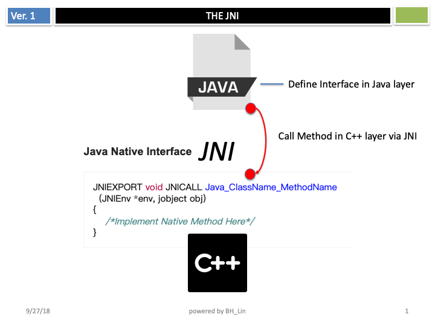
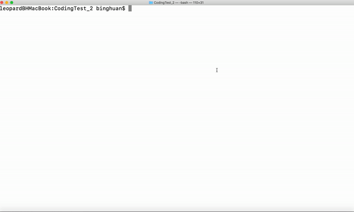
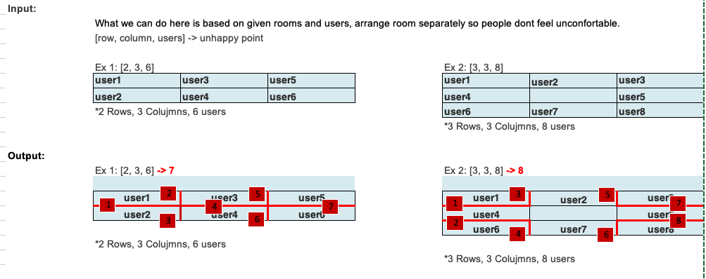

# MyRakutenSingapore

	
## Guide:

Thank you for your interesting in our Android Engineer Position.
	We have been asking all candidates to answer two coding tests. It expect 2 - 3 hours in Questions, please make sure to secure your time.
	
### Coding Test 1.
  
You can find first quize at "Coding Test 1" tab.   
Please write your answer code and share it with us. This quiz to check your Android NDK capability.   
We are developing Chromium based browser application, so expect candidate has ability to work for Android NDK.  

_________________________  

	
### Coding Test 2.  
You can find second quize at "Coding Test 2" tab.   
Please write your answer code on repl.it *1 by using Java.   
Expect candidate to be resolved within 1 - 1.5 hours in Question.  
*1: <https://repl.it/>   
**Please sign up / Log in to "repl.it" before starting the coding test  

#### Command for execute script for coding question 2. 
<code>
cd CodingTest_2  
node meetingRoomArrangment.js
</code>

	
#### How to share the Coding Test result with us.
Please send your answer to "****@rakuten.com"  
Coding Test 1. Please share your compress package or Git repository and so on with him.  
Coding Test 2. You can find "Share Link(=answer link)" at inside of Share icon on repl.it. Please share this "Share Link" with him.  

	
## Question1 - Cout up android Application:
Please create android app will do below things;  
	1. Every time user tap the button on the screen, the number will count up like 1,2,3,4,5,.....  
	2. This count up logic is using ndk and user interface is using SDK.  

## Question2 - Meeting room arrangement:

We are thinking to arrange meeting room.  
Meeting room is always noisy, and you are thinking to separate each room users as possible as you can so that they dont feel uncomfortable.  							
If they are facing each other, we will add unhappy point as 1.  	
		
								
Input Data:							
you can use this data as input to show output  
<https://drive.google.com/open?id=1qWN57M46rUuik6mLy4Pf8XaBcOjrG6Q7>				
								
Your program in repl.it has to show output right away once we press the 'run' button						
so either putting given data into code or using stdin in repl are fine								
	*Reference* Expected result:							
		Here is expected answer from above data: Please resolve this with your program						
		[5,2,8]-> 7 [3,5,14]-> 18 [1,16,1]-> 0 [3,5,1]-> 0 [8,2,12]-> 10 [16,1,1]-> 0 [3,3,6]-> 3 [2,6,12]-> 16 [15,1,0]-> 0 [5,3,7]-> 0 [4,3,5]-> 0 [3,5,11]-> 8 [7,2,13]-> 16 [15,1,6]-> 0 [15,1,15]-> 14 [4,4,9]-> 2 [5,3,8]-> 0 [3,5,6]-> 0 [16,1,7]-> 0 [1,15,7]-> 0 [4,3,12]-> 17 [5,3,13]-> 14 [2,4,5]-> 2 [5,3,5]-> 0 [16,1,16]-> 15 [2,5,8]-> 7 [5,3,4]-> 0 [5,3,10]-> 6 [4,4,7]-> 0 [3,5,9]-> 3 [4,2,2]-> 0 [4,4,15]-> 20 [2,2,4]-> 4 [5,3,11]-> 8 [4,4,8]-> 0 [1,16,9]-> 1 [4,4,16]-> 24 [1,15,6]-> 0 [15,1,8]-> 0 [5,3,6]-> 0 [16,1,9]-> 1 [3,5,15]-> 22 [1,15,1]-> 0 [1,15,0]-> 0 [2,5,9]-> 10 [3,5,10]-> 6 [1,15,15]-> 14 [3,2,0]-> 0 [5,3,2]-> 0 [5,3,1]-> 0 [5,2,4]-> 0 [3,5,4]-> 0 [2,7,13]-> 16 [3,3,0]-> 0 [7,2,11]-> 10 [4,4,0]-> 0 [1,1,0]-> 0 [2,6,9]-> 7 [3,5,3]-> 0 [5,3,15]-> 22 [5,2,6]-> 2 [3,4,12]-> 17 [2,3,6]-> 7 [1,1,1]-> 0 [15,1,1]-> 0 [1,16,16]-> 15 [2,2,2]-> 0 [3,3,9]-> 12 [16,1,8]-> 0 [9,1,6]-> 2 [5,3,12]-> 11 [2,2,3]-> 2 [3,5,7]-> 0 [7,2,0]-> 0 [4,3,6]-> 0 [2,3,4]-> 2 [1,15,8]-> 0 [16,1,0]-> 0 [5,3,9]-> 3 [15,1,7]-> 0 [2,4,6]-> 4 [1,16,7]-> 0 [3,5,12]-> 11 [1,16,8]-> 0 [4,4,1]-> 0 [3,5,0]-> 0 [3,5,8]-> 0 [1,16,0]-> 0 [5,3,3]-> 0 [5,3,0]-> 0 [1,13,9]-> 4 [3,5,2]-> 0 [1,9,6]-> 2 [6,2,12]-> 16 [4,3,8]-> 4 [3,5,5]-> 0 [5,3,14]-> 18 [4,3,7]-> 2 [6,2,4]-> 0 [3,5,1]-> 0

Coding Quest from Singapore Rakuten.
